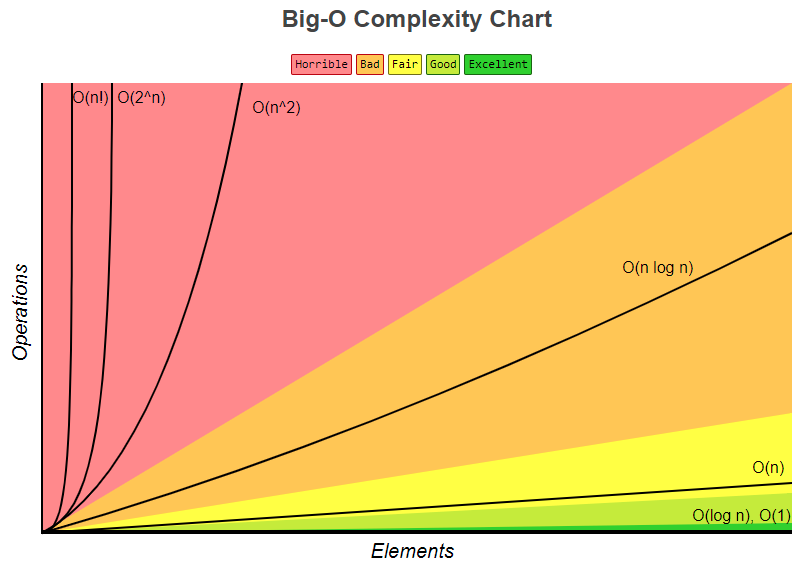

# Big-O - Definition, Examples and Benchmark
In a nutshell, Big-O is a rating for the complexity of the algorithm based on the cost or processing time.

## **Big-O - Notations**
Big-O notations are mathematical notations that can be used to describe the complexity of the algorithm.

### O(1) (constant)
There is no growth in the number of operations as it does not depend on the volume of input data (n).

### O(log n) (logarithmic) 
The growth in the number of operations is less than the growth in the number of items.

### O(n) (linear)
The growth in the number of operations is directly proportional to the growth in the number of items.

### O(n log n) (Linearithmic or quasilinear)
It is the result of operations **(log n)** performed **n** times.

### O(n^2) (quadratic)
Occurs when data items are processed in pairs, often with repetitions within each other.

### O(2^n) (exponential)
As n increases, the analyzed factor (time or space) increases exponentially.

### O(n!) (factorial)
The number of executed instructions grows very quickly for a small amount of data.

## **Big-O - Alternative Notation**

| Big-O         | Alternative   |
| ------------- | ------------- |
| **O(1)**  		| **O(yeah)**		|
| **O(log n)** 	| **O(nice)**		|
| **O(n)** 		  | **O(ok)**			|
| **O(n log n)**| **O(uch)**  	|
| **O(n^2)** 		| **O(my)** 	 	|
| **O(2^n)**  	| **O(no)**	 		|
| **O(n!)**			| **O(mg!)**  	|